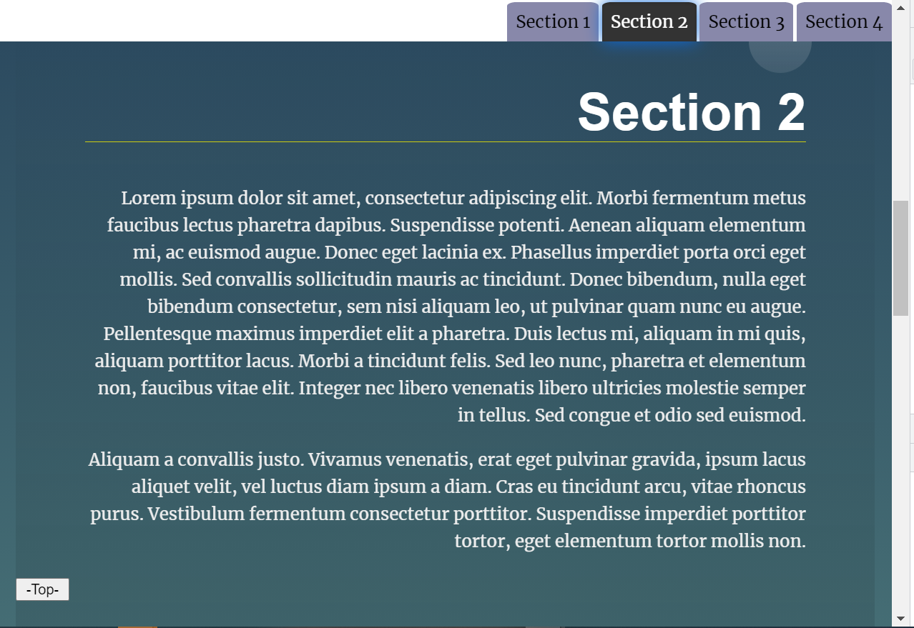
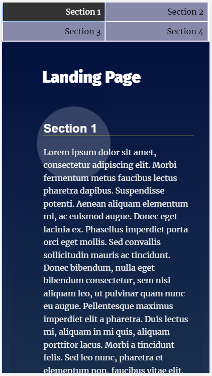
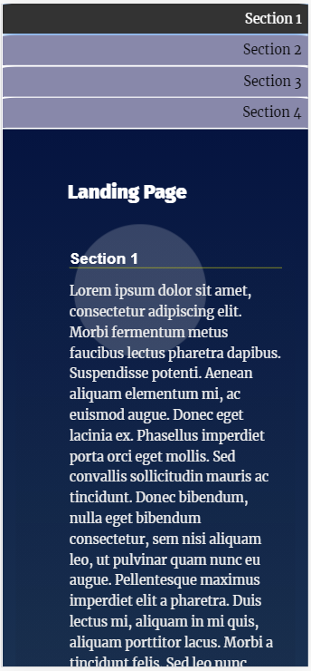

# Landing Page Project {#title}

## Table of Contents

* [Description](#desc)
* [Screenshot](#screens)
* [Architucture Screenshot](#architucture)
* [Areas for improvement](#improvement)
* [Thanks](#thanks)

## Description {#desc}

Landing Page project is a typical multi-section landing page with a dynamically updating navigational menu based on the amount of content that is added to the page. This page can be populated with different type of contents with variety of design. 
 
The Design, styles and features are usable across modern desktop, tablet, and phone browsers 
A friendly UX is used where the active section of content is highlighted to be clear which section is being viewed while scrolling through the page. The active section is assigned to the section that consumes more than a half of the view port. Also, the user can jump directly to any desired section by clicking its equivalent item in the navigation menu, and the page scrolls smoothly to the target section. Active state is added to the the navigation items when its corresponding section is in the viewport. 
 
The fixed navigation bar becomes hidden when the user scrolls down to have more room for the content, while it is shown again when the user scrolls up to make it faster to navigate to another section by clicking on a different menu item. The navigation bar is always being displayed on page load. 
 
A scroll-to-top button is added at the bottom of each section to have a smooth yet quick acces to the top of the page. This button is dynamically dispalyed according to the active section being viewed. 
 
The structure of the Landing Page's original design has been modified slightly to facilitate the implementation of the page features. 
 
[(Back to top)](#title)
  

## Screenshot {#screens}

- ### preview on wide screen
  

- ### preview on Pixel 2
  

- ### preview on iPhone X
  

[(Back to top)](#title)

## Architucture overview {#architucture}

-  The concept of micro services is applied for clearer architecture and efficient code.  
- The design of functions aimed to let them re-usable easily to implement different features. 
- Minimum Event Listener have been added to have a cleaner code and better performance, e.g. one listener is added for the whole navigation menu.
- The performance is taken into consideration too.
- Clean code is used. comments is used for extra explanation of the code where the code itself is self-explanatory.

[(Back to top)](#title)

## Areas for improvement {#improvement}

- The technique used to dispaly the scroll-to-top button for a cleaner, straightforward, and better performance.
- TYhe data structure used to keep track of position, active sections and menu item.
- The structure and the style of the page to make it eaier for implementation.

[(Back to top)](#title)

## Thanks {#thanks}

Leave a star in GitHub. 

[(Back to top)](#title)

